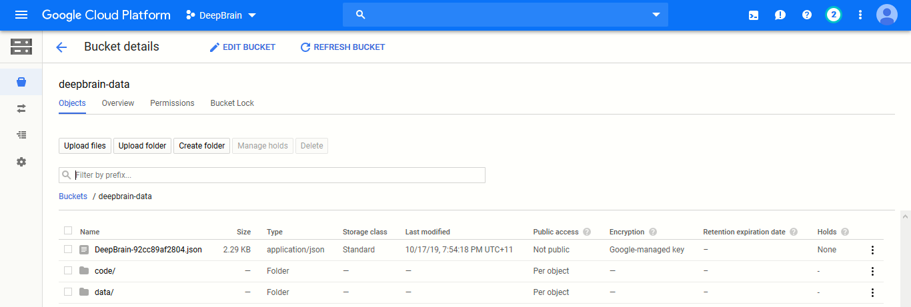
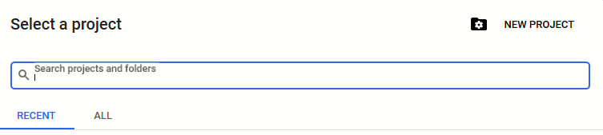
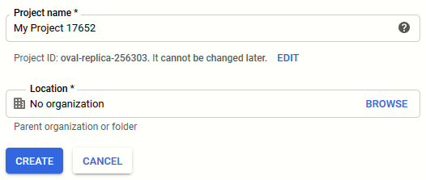
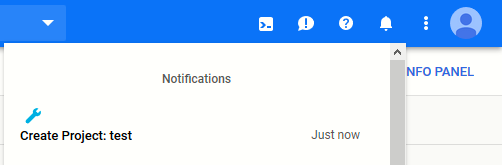

# GCP - Creating Computing Resources
Documentation and resources for creating the necessary computing resources needed to run Deep learning models on Google Cloud Platform (GCP). 
 
### Key Background Information
GCP allows users to utilise their high-performance machines to run, train and deploy (for production) data-heavy models, whether they are a Machine learning, a Deep learning or a computationally expensive system. Such resources include:
  - **CPUs**
  - **GPUs**
  - **TPUs**

In addition to computing power, GCP offers storage capacities to cater for different forms and sizes of data. Tools that are applicable to us are:  
  - **Google Storage**: a "Google Drive" clone used to store data on a file-directory system organised in a hierarchy. This is accessed via a User-interface that allows for basic file and folder uploads from local machines to the cloud service.   
  
    
  An advantage to using GCP's storage facilities, is the smooth integration of GCP's services. For example, when opting to store training data for a deep learning model on GCP Storage, multiple computing resources on GCP can connect to it via the g-suite API service which allows for importing and exporting to/from these resources data efficiently (as opposed to using local machines with slow I/O operations, building custom scripts or using additional 3rd part applications to transfer and connect data to VM instances over the net). In short, <b>Storing large data, that needs to be utilised by GPC services, on GCP Storage is <i>recommended</i>...</b>

### Creating a GCP Project
Assuming a GCP account has been activated, the first step is to create a GCP project. This is to allow a user to utilise the services GCP provides. Normally, this is created on an individual <i>project</i> basis, as GCP projects are distinct in their resources. This means that all the services created within a GCP project are unique to it and cannot be easily accessed by other GCP projects.  
<b>NOTE:</b> There is a quota for how many GCP projects can be created on an account (Maximum of 22). Be careful to not exhaust this resource. Contacting Google to increase this quota is possible, if need be...    
So, to create a project:
  1. Click on the currently-selected project name in the top-left corner of the console dashboard ("DeepBrain" in the example below).
    
  
    
  1. After a Popup appears, click on the "New Project" button in the top right corner of the popup.
    
  
    
  1. Provide the GCP project with a meaningful name. There is also an option to edit the Project ID which is used as a reference for the project throughout GCP (this cannot be changed later, so make sure that you initially are happy with it so you don't need to change it later on). Organisation can be left as "No Organisation". Click "Create".
    
  
    
  1. You will be directed to the "Resource Management" page, in which all the projects that have been created will be visible. Wait for the new project to be configured by GCP and it should appear shortly in the list.   
  <b>Quick tip:</b> There is a "Notification" bar at the top right corner of the screen (the bell icon). It shows updates about newly-created, modified and/or deleted resources in GCP. Observe this bar to confirm that the project has indeed been created successfully ...  
    
  
    