# Run PyTorch Deeplearning framework in GCP

### Launch a GPU Instance

#### Step 1 : Create a new project
Click on the three dots shown in the image below and then click on the + sign to create a new project.
  
    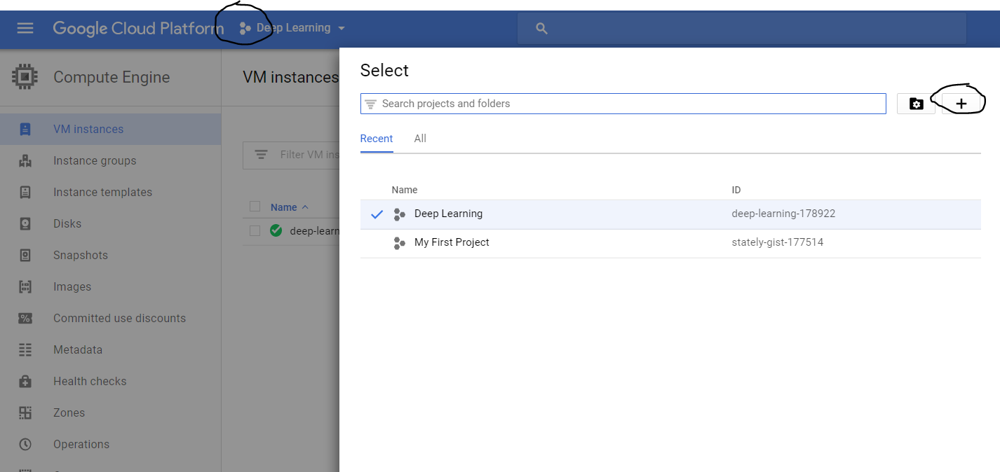
  

#### Step 2 : Create a VM instance
Click on the three lines on the upper left corner, then on the compute option, click on ‘Compute Engine’
  
    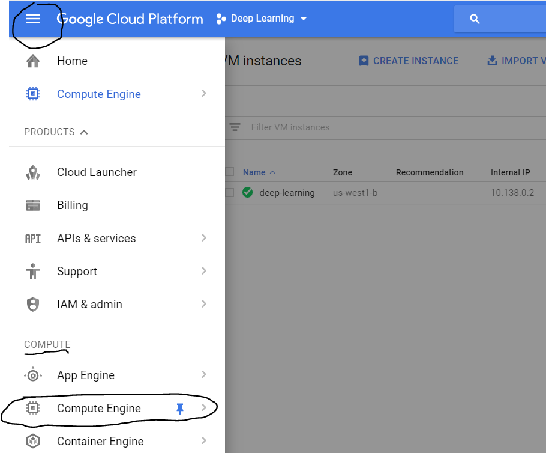
  

Now click on ‘Create new instance’. Name your instance, select zone as ‘ us-west1-b’. Choose your ‘machine type’. (I chose 8v CPUs).
Select your boot disk as ‘Ubuntu 16.04 LTS’. 
  
    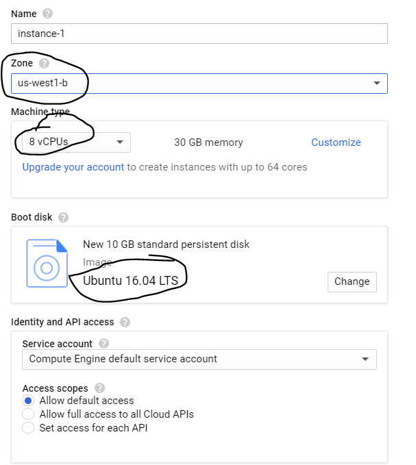
  

Under the firewall options tick both ‘http’ and ‘https’ (very important). Then, choose the disk tab and untick ‘ Delete boot disk when instance is deleted’.
  
    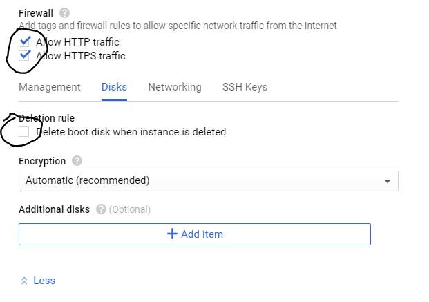
  

If you click on ‘customize’, you will be able to find options for using GPUs. You can choose between 2 NVIDIA GPUs.
  
    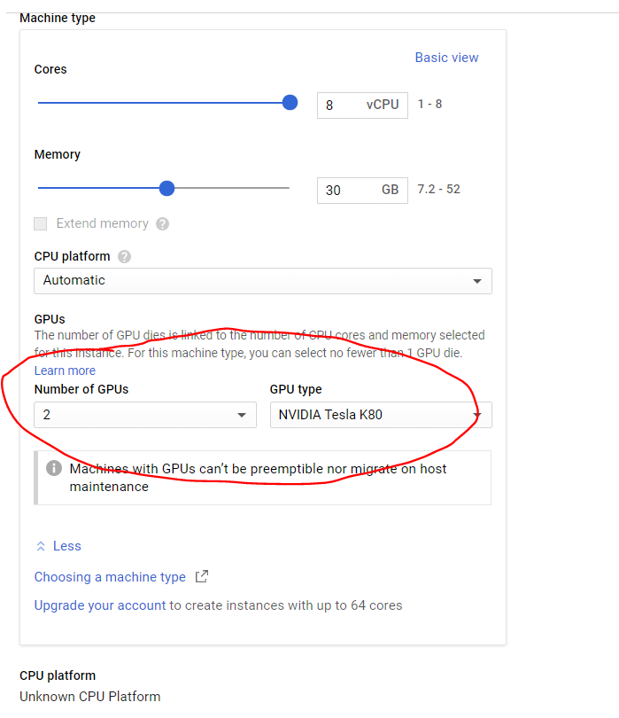
  

Now click on ‘Create’ and your instance is ready!

#### Step 3 : Make external IP address as static
By default, the external IP address is dynamic and we need to make it static to make our life easier. Click on the three horizontal lines on top left and then under networking, click on VPC network and then External IP addresses.
  
    
  

Change the type from Ephemeral to Static.
  
    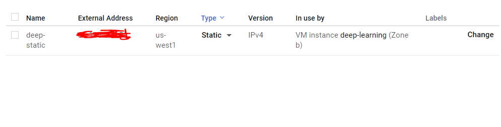
  

#### Step 4 : Change the Firewall setting
Find the "Firewall rules" from VPC Network
Now, click on the ‘Firewall rules’ setting under Networking.

  
    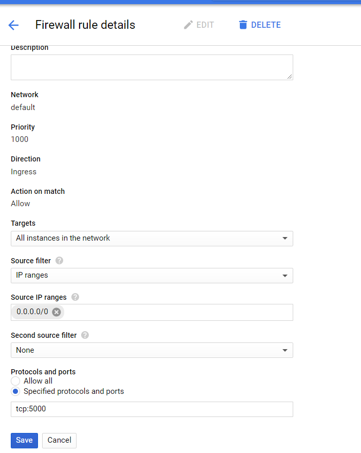
  

Under protocols and ports you can choose any port. I have chosen tcp:5000 as my port number. Now click on the save button.

#### Step 5 : Start your VM instance
Now start your VM instance. When you see the green tick click on SSH. This will open a command window and now you are inside the VM.
  
    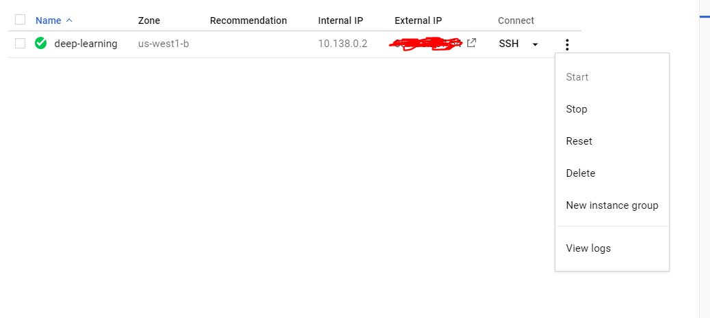
  

#### Step 6 : Install Jupyter notebook and other packages

In your SSH terminal, enter:
wget http://repo.continuum.io/archive/Anaconda3-4.0.0-Linux-x86_64.sh
Then, enter:
bash Anaconda3-4.0.0-Linux-x86_64.sh
  
    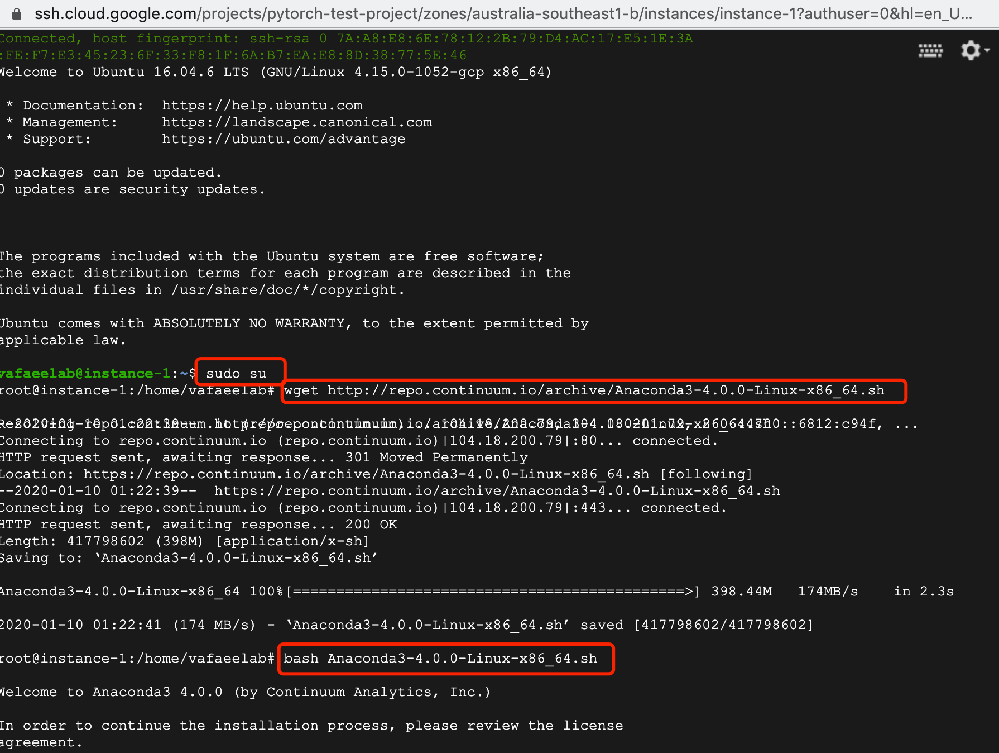
  

and follow the on-screen instructions. The defaults usually work fine, but answer yes to the last question about prepending the install location to PATH:

Do you wish the installer to prepend the 
Anaconda3 install location to PATH 
in your /home/haroldsoh/.bashrc ? 
[yes|no][no] >>> yes

To make use of Anaconda right away, source your bashrc:

source ~/.bashrc

Now, install other softwares through terminal :
pip install tensorflow
pip install keras

#### Step 7 : Set up the VM server
Open up a SSH session to your VM. Check if you have a Jupyter configuration file:
ls ~/.jupyter/jupyter_notebook_config.py

If it doesn’t exist, create one:
jupyter notebook --generate-config

We’re going to add a few lines to your Jupyter configuration file; the file is plain text so, you can do this via your favorite editor (e.g., vim, emacs). Make sure you replace the port number with the one you allowed firewall access to in step 5.

c = get_config()
c.NotebookApp.ip = '*'
c.NotebookApp.open_browser = False
c.NotebookApp.port = 5000

It should look something like this :
  
    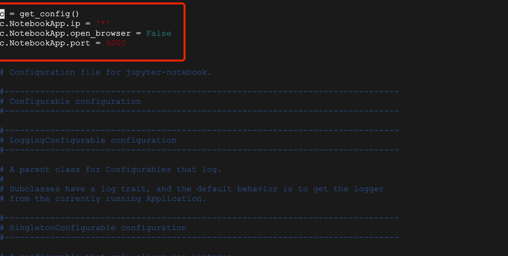
  

#### Step 8 : Launching Jupyter Notebook
To run the jupyter notebook, just type the following command in the ssh window you are in :
jupyter-notebook --no-browser --port=5000

Once you run the command, it should show something like this:
  
    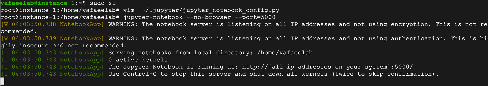
  

Now to launch your jupyter notebook, just type the following in your browser:

http://<External Static IP Address>:<Port Number>
where, external ip address is the ip address which we made static and port number is the one which we allowed firewall access to.
  
    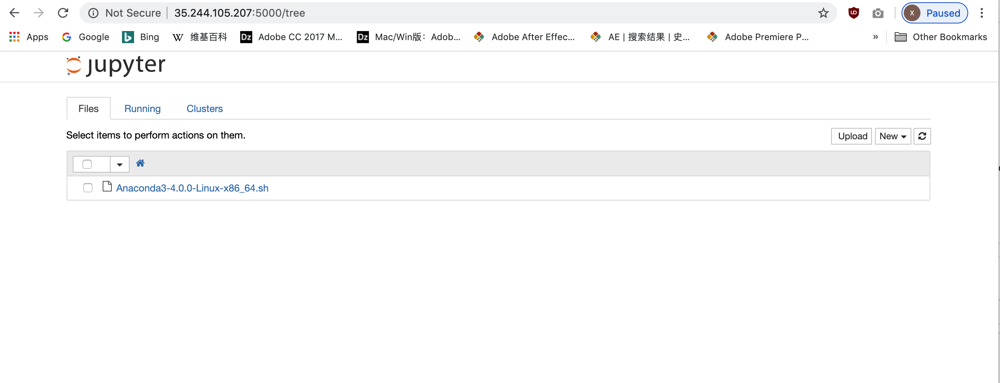
  
    
#### Congratulations! You successfully installed jupyter notebook on GCP!
