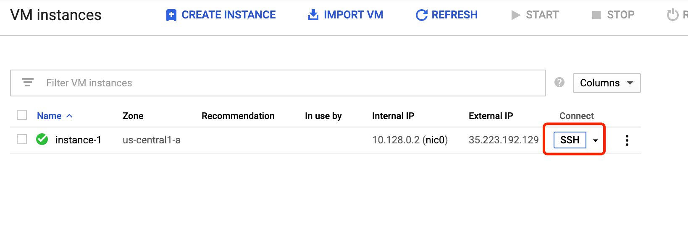
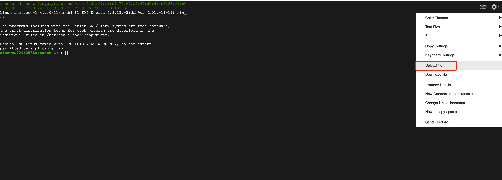
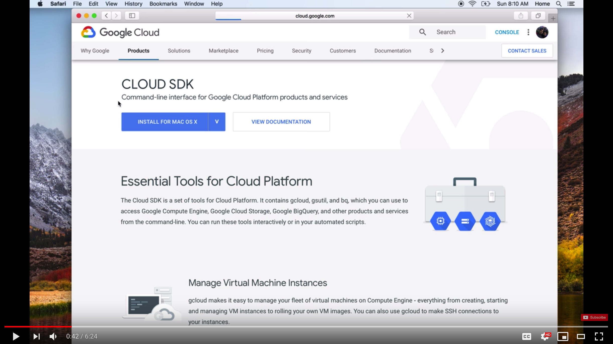

# GCP - Storage Resources
Documentation and resources for creating the necessary storage resources needed to run Deep learning models on Google Cloud Platform (GCP). 

 

### Introduction of GCP Storage/Buckets
Cloud Storage is a flexible, scalable, and durable storage option for your virtual machine instances. You can read and write files to Cloud Storage buckets from almost anywhere, so you can use buckets as common storage between your instances, App Engine, your on-premises systems, and other cloud services.

### Command-line
You need to install or update the latest version of the gcloud command-line tool.
Please refer here:https://cloud.google.com/compute/docs/gcloud-compute/

### Data Transmission

### 1.from local to instance

#### graphical uploading
###### Upload/Download using SSH
To download or upload a file using SSH click the SSH button next to your VM Instance to open a terminal in your web browser.
Click the top right gear icon in your terminal window to upload or download a file directly. This method will be very slow compared to the above all process.
      
    
    
      
    
#### terminal command
##### you need to installl gcloud command-line tool/gsutil
Transferring files using the gcloud command-line tool

The gcloud command-line tool provides an SCP file transfer utility, creating an SSH key pair for you the first time you connect. Your private key is stored on your local device and its corresponding public key is copied to project or instance metadata.

1.Install and Setup Google Cloud SDK.
2.Once you have installed Google Cloud SDK you can use the gsutil or gcloud command to transfer the files using gsutil cp command.
3.Open terminal in your local computer and configure the project you wish to use. Run the following command to set up gcloud
Please refer https://cloud.google.com/storage/docs/gsutil_install#deb to get the instructions of how to install gsutil

###### Google Cloud Storage to the local computer
gsutil -m cp -r gs://bucket_name/folder dir

###### Local computer to Google Cloud Storage
gsutil -m cp -r dir gs://bucket_name/folder

### 2.from instance to instance

###### From one instance to another
gcloud compute scp FILE_NAME --project TARGET_PROJECT_ID TARGET_INSTANCE_NAME:folder_name --zone region

### 3.from instance to storage

###### Google Cloud Storage to Google Compute Engine
gsutil cp gs://bucket_name/filename /home/username/folder_name

###### Google Compute Engine to Google Cloud Storage
gsutil cp filename gs://bucket_name

